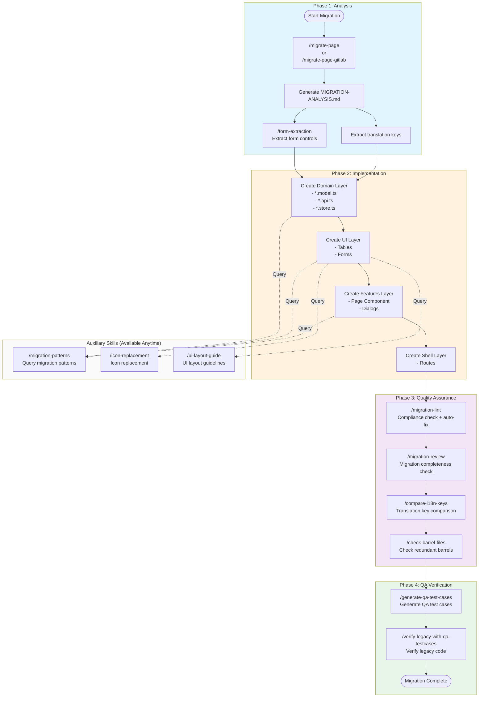
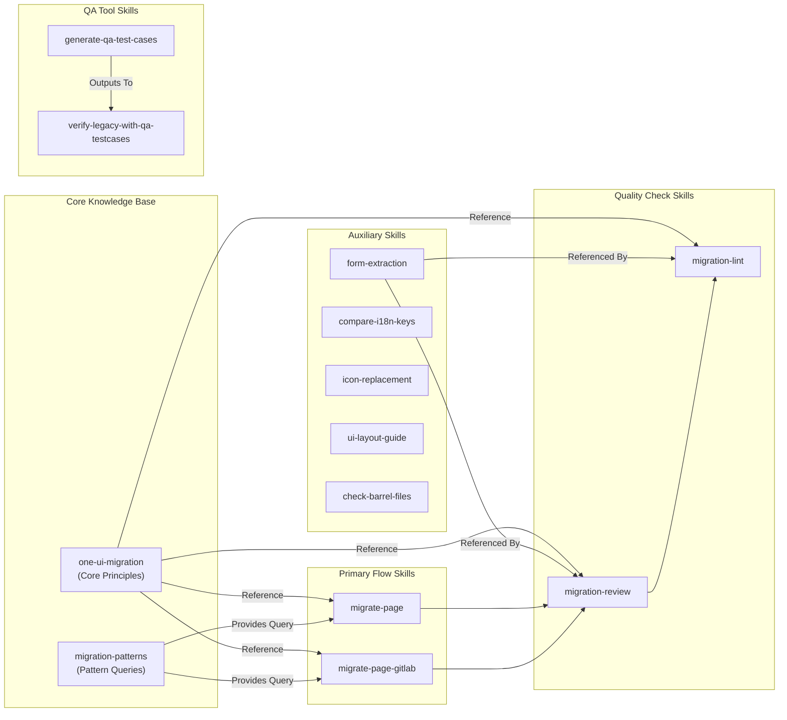
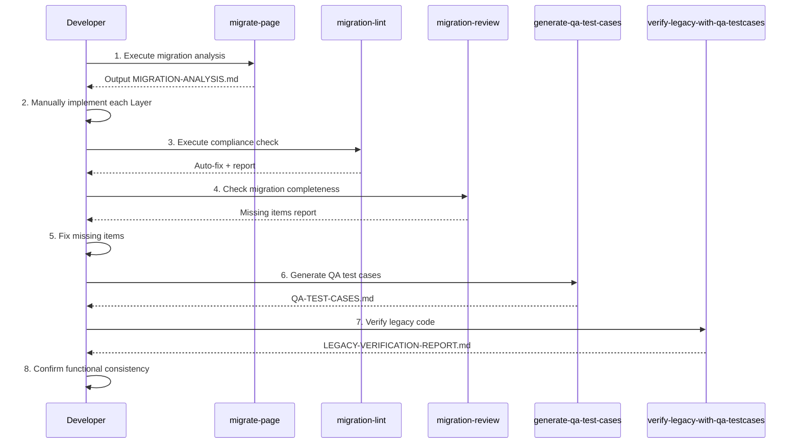

# Angular Migration Workflow

Complete Angular migration workflow documentation, including skill usage and best practices.

## Skills Classification Overview

| Category | Skills | Purpose |
| -------- | ------ | ------- |
| **Automated Pipeline** | `full-migration-pipeline` | One-click complete migration |
| **Primary Migration Flow** | `migrate-page`, `migrate-page-gitlab` | Execute full migration |
| **Core Reference** | `one-ui-migration`, `migration-patterns` | Migration principles and pattern queries |
| **Quality Assurance** | `migration-lint`, `migration-review` | Code compliance checks |
| **QA Verification** | `generate-qa-test-cases`, `verify-legacy-with-qa-testcases` | Test case generation and verification |
| **Auxiliary Tools** | `form-extraction`, `compare-i18n-keys`, `icon-replacement`, `ui-layout-guide`, `check-barrel-files` | Task-specific assistance |

## Migration Workflow Diagram



## Skills Dependency Diagram



## Detailed Phase Descriptions

### Phase 1: Analysis

**Objective:** Understand legacy code structure, generate migration analysis document

| Step | Skill | Output |
| ---- | ----- | ------ |
| 1 | `/migrate-page --from=<source> --to=<target>` | `MIGRATION-ANALYSIS.md` |
| 2 | `/form-extraction` (auxiliary) | Form controls list |

**Output Location:** `{target}/domain/src/lib/docs/MIGRATION-ANALYSIS.md`

### Phase 2: Implementation

**Objective:** Create each layer following DDD architecture

| Layer | Contents | Query Skill |
| ----- | -------- | ----------- |
| Domain | `*.model.ts`, `*.api.ts`, `*.store.ts`, `*.helper.ts` | `/migration-patterns store` |
| UI | Tables, Forms (input/output only) | `/migration-patterns table`, `/ui-layout-guide` |
| Features | Page Component, Dialogs | `/migration-patterns dialog` |
| Shell | Routes, Resolvers | - |

### Phase 3: Quality Assurance

**Objective:** Ensure code compliance with migration standards

| Step | Skill | Description |
| ---- | ----- | ----------- |
| 1 | `/migration-lint <path>` | Auto-fix + generate compliance report |
| 2 | `/migration-review --from=<old> --to=<new>` | Compare migration completeness |
| 3 | `/compare-i18n-keys --from=<old.html> --to=<new.html>` | Verify translation key consistency |
| 4 | `/check-barrel-files <path>` | Remove redundant barrel files |

### Phase 4: QA Verification

**Objective:** Generate test cases, confirm functional consistency

| Step | Skill | Output |
| ---- | ----- | ------ |
| 1 | `/generate-qa-test-cases <path>` | `QA-TEST-CASES.md` |
| 2 | `/verify-legacy-with-qa-testcases <legacy-path>` | `LEGACY-VERIFICATION-REPORT.md` |

**Output Location:** `{target}/domain/src/lib/docs/`

## Best Practice Workflow (Sequence)



## Auxiliary Skills Usage Timing

| Skill | When to Use |
| ----- | ----------- |
| `/migration-patterns <keyword>` | Whenever querying migration patterns (table, form, dialog, layout, button, store, syntax, validator) |
| `/icon-replacement <icon-name>` | When encountering legacy icons that need replacement |
| `/ui-layout-guide <query>` | When querying best practices for UI layout creation |
| `/form-extraction` | When needing to extract form structure for comparison |

## Notes

- E2E test generation and API Mock generation are not currently required
- Performance checks are secondary to migration, implementation deferred

## Quick Command Reference

```bash
# One-click complete migration workflow (recommended)
/full-migration-pipeline --from=/path/to/old --to=libs/mx-ros/xxx-page
/full-migration-pipeline --page=xxx  # From GitLab

# Manual execution of each phase
/migrate-page --from=/path/to/old --to=libs/mx-ros/xxx-page
/migration-lint libs/mx-ros/xxx-page
/migration-review --from=/path/to/old --to=libs/mx-ros/xxx-page
/generate-qa-test-cases libs/mx-ros/xxx-page
/verify-legacy-with-qa-testcases /path/to/old

# Query patterns
/migration-patterns table
/migration-patterns form
/migration-patterns dialog

# Auxiliary tools
/icon-replacement settings
/ui-layout-guide card
/check-barrel-files libs/mx-ros/xxx-page
```
