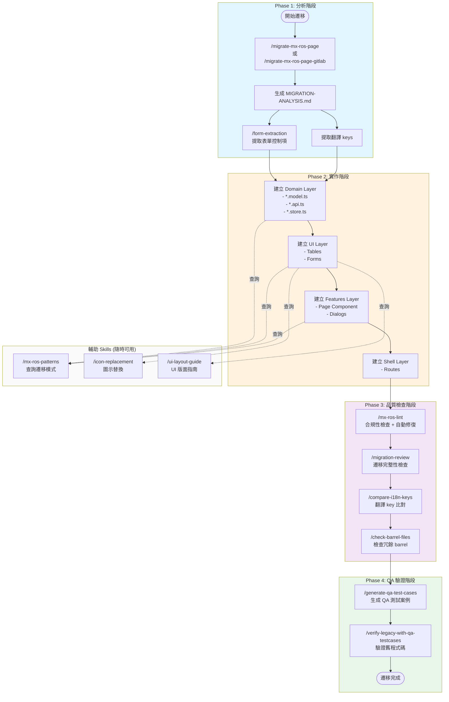
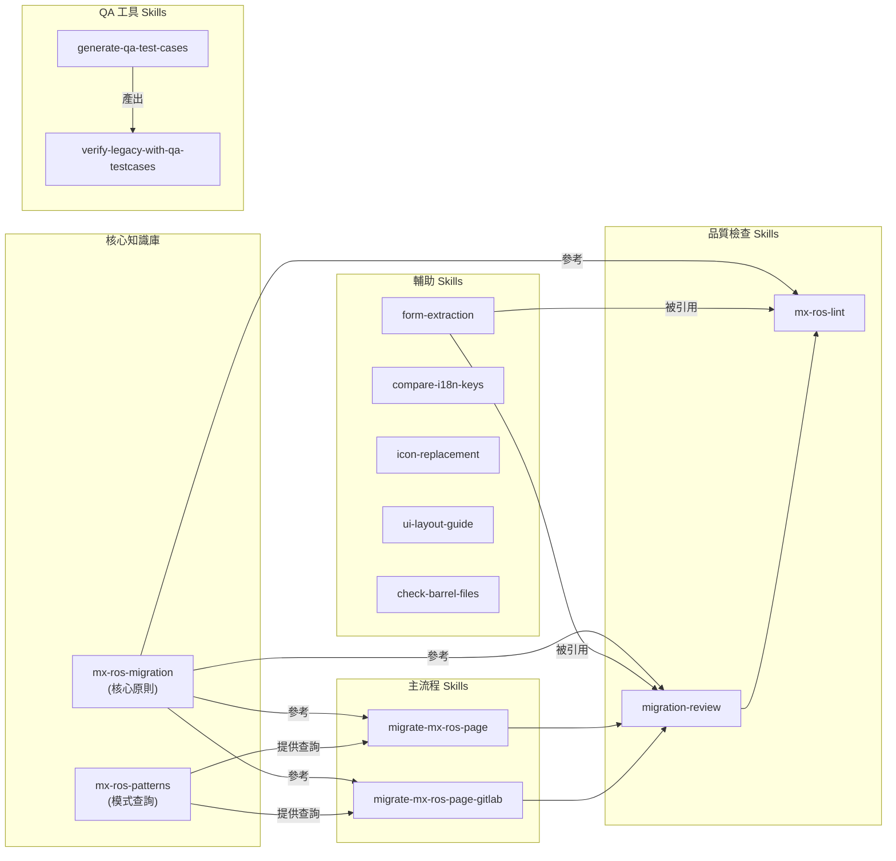
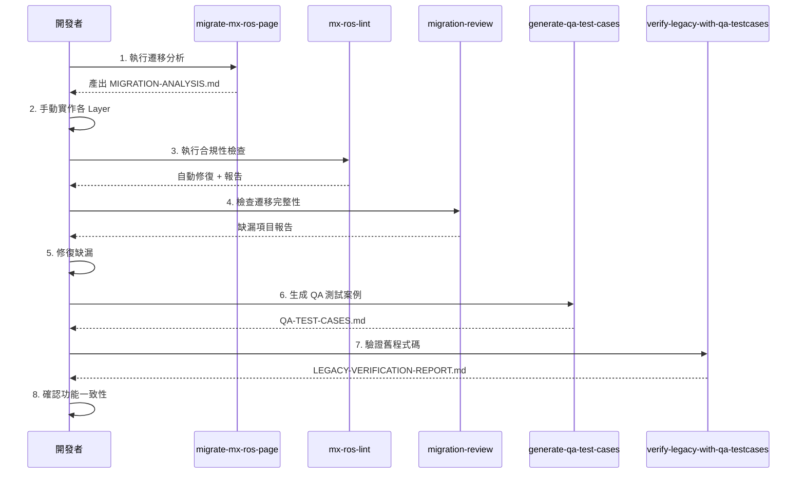

# MX-ROS Migration Workflow

完整的 MX-ROS 遷移工作流程說明，包含 Skills 使用方式和最佳實踐。

## Skills 分類總覽

| 類別             | Skills                                                                                              | 用途               |
| ---------------- | --------------------------------------------------------------------------------------------------- | ------------------ |
| **自動化流程**   | `full-migration-pipeline`                                                                           | 一鍵執行完整遷移   |
| **主要遷移流程** | `migrate-mx-ros-page`, `migrate-mx-ros-page-gitlab`                                                 | 執行完整遷移       |
| **核心參考**     | `mx-ros-migration`, `mx-ros-patterns`                                                               | 遷移原則與模式查詢 |
| **品質檢查**     | `mx-ros-lint`, `migration-review`                                                                   | 程式碼合規性檢查   |
| **QA 驗證**      | `generate-qa-test-cases`, `verify-legacy-with-qa-testcases`                                         | 測試案例生成與驗證 |
| **輔助工具**     | `form-extraction`, `compare-i18n-keys`, `icon-replacement`, `ui-layout-guide`, `check-barrel-files` | 特定任務輔助       |

## 遷移工作流程圖



## Skills 依賴關係圖



## 各階段詳細說明

### Phase 1: 分析階段

**目標：** 了解舊程式碼結構，產出遷移分析文件

| 步驟 | Skill                                                | 產出                    |
| ---- | ---------------------------------------------------- | ----------------------- |
| 1    | `/migrate-mx-ros-page --from=<source> --to=<target>` | `MIGRATION-ANALYSIS.md` |
| 2    | `/form-extraction` (輔助)                            | 表單控制項清單          |

**產出文件位置：** `{target}/domain/src/lib/docs/MIGRATION-ANALYSIS.md`

### Phase 2: 實作階段

**目標：** 按照 DDD 架構建立各 Layer

| Layer    | 內容                                                  | 查詢 Skill                                   |
| -------- | ----------------------------------------------------- | -------------------------------------------- |
| Domain   | `*.model.ts`, `*.api.ts`, `*.store.ts`, `*.helper.ts` | `/mx-ros-patterns store`                     |
| UI       | Tables, Forms (input/output only)                     | `/mx-ros-patterns table`, `/ui-layout-guide` |
| Features | Page Component, Dialogs                               | `/mx-ros-patterns dialog`                    |
| Shell    | Routes, Resolvers                                     | -                                            |

### Phase 3: 品質檢查階段

**目標：** 確保程式碼符合遷移規範

| 步驟 | Skill                                                  | 說明                    |
| ---- | ------------------------------------------------------ | ----------------------- |
| 1    | `/mx-ros-lint <path>`                                  | 自動修復 + 產出合規報告 |
| 2    | `/migration-review --from=<old> --to=<new>`            | 比對遷移完整性          |
| 3    | `/compare-i18n-keys --from=<old.html> --to=<new.html>` | 確認翻譯 key 一致       |
| 4    | `/check-barrel-files <path>`                           | 移除冗餘 barrel files   |

### Phase 4: QA 驗證階段

**目標：** 產出測試案例，確認功能一致性

| 步驟 | Skill                                            | 產出                            |
| ---- | ------------------------------------------------ | ------------------------------- |
| 1    | `/generate-qa-test-cases <path>`                 | `QA-TEST-CASES.md`              |
| 2    | `/verify-legacy-with-qa-testcases <legacy-path>` | `LEGACY-VERIFICATION-REPORT.md` |

**產出文件位置：** `{target}/domain/src/lib/docs/`

## 最佳實踐流程 (Sequence)



## 輔助 Skills 使用時機

| Skill                           | 使用時機                                                                                 |
| ------------------------------- | ---------------------------------------------------------------------------------------- |
| `/mx-ros-patterns <keyword>`    | 任何時候需要查詢遷移模式 (table, form, dialog, layout, button, store, syntax, validator) |
| `/icon-replacement <icon-name>` | 遇到舊圖示需要替換時                                                                     |
| `/ui-layout-guide <query>`      | 建立 UI 版面時查詢最佳實踐                                                               |
| `/form-extraction`              | 需要提取表單結構進行比對時                                                               |

## 備註

- E2E 測試生成、API Mock 生成目前不需要
- 效能檢查以遷移為主，暫緩實作

## 快速指令參考

```bash
# 一鍵執行完整遷移流程 (推薦)
/full-migration-pipeline --from=/path/to/old --to=libs/mx-ros/xxx-page
/full-migration-pipeline --page=xxx  # 從 GitLab

# 手動執行各階段
/migrate-mx-ros-page --from=/path/to/old --to=libs/mx-ros/xxx-page
/mx-ros-lint libs/mx-ros/xxx-page
/migration-review --from=/path/to/old --to=libs/mx-ros/xxx-page
/generate-qa-test-cases libs/mx-ros/xxx-page
/verify-legacy-with-qa-testcases /path/to/old

# 查詢模式
/mx-ros-patterns table
/mx-ros-patterns form
/mx-ros-patterns dialog

# 輔助工具
/icon-replacement settings
/ui-layout-guide card
/check-barrel-files libs/mx-ros/xxx-page
```
